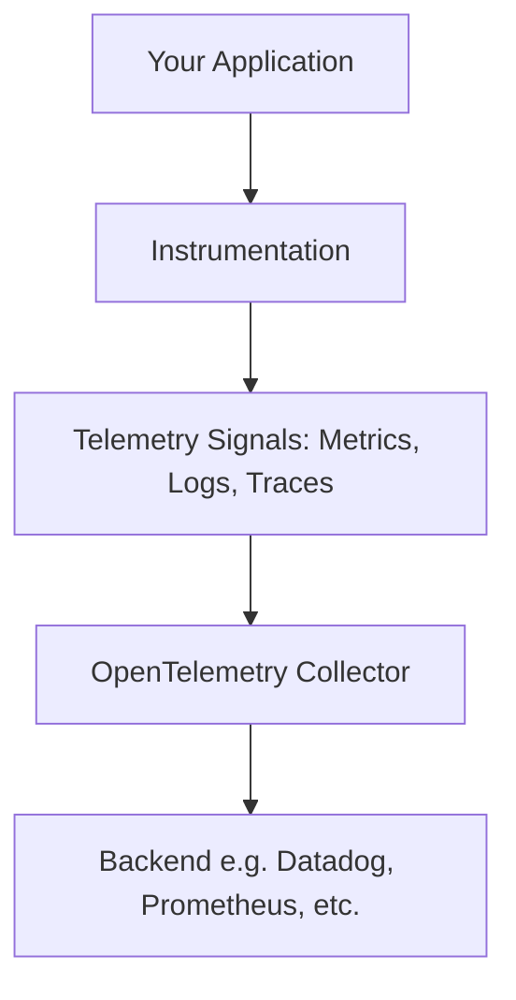
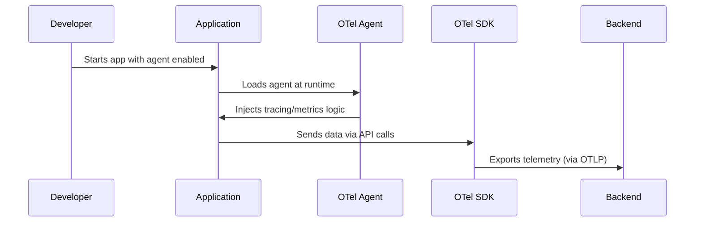

You: 

 I have shared a transcript on "About OpenTelemetry" in context with Instrumentation with OpenTelemetry. Pls explain in a crystal clear format with interactive icons. "Welcome back. Now we are all set to start with Opentelemetry foundations. In an earlier lesson, we learned why observability is important for a modern organization, whether large or small, to meet the growing need for observability. Multiple open source projects began building data collection frameworks. This led to the creation of open tracing and open census projects. In 2019, these two projects merged to form Opentelemetry. This is important to know because you might come across organizations still using open tracing or open sciences. They need to upgrade to Opentelemetry to get the latest observability features. Opentelemetry is part of the Cloud Native Computing Foundation family. According to a 2023 report, it's the second most active CNCF project, right behind Kubernetes, and 57% of organizations are already using or evaluating using Opentelemetry in production. So what is the core objective of Opentelemetry? At its heart, Opentelemetry exists to provide an open source alternative for observability data collection. It achieves this data collection objective by providing capabilities for generating, collecting and exporting telemetry data from software systems. We saw this diagram which shows Opentelemetry focus on data collection in an earlier lesson. Opentelemetry project follows two key principles. First, you own the data that you generate. This means if you decide to change your observability solution, you only have to change your back end, which is much easier than changing your data collection methods. Second, as a developer or person implementing observability, you only have to learn a single set of APIs and conventions. Next, let's see how Opentelemetry generates, collects, and exports elementary data at a high level. We will divide these actions into two sections. Generate and collect and export. So what does Opentelemetry collect? It collects telemetry signals, which are metrics, logs and traces, which we discussed in an earlier lesson. There's also a fourth component called baggage, which we will introduce later. For now, let's stick with metrics, logs, and traces. Opentelemetry collects this data using instrumentation. There are three instrumentation methods that Opentelemetry supports. Zero code libraries and code based, and APIs and SDKs are the components that enable this zero code and code based instrumentation along with libraries. Once this telemetry data is collected, it needs to be exported to a backend for Our analysis. This is handled by Opentelemetry export functionality. Opentelemetry achieves this through Otlp and collector. Otlp stands for Opentelemetry protocol, and the collector is a proxy server that receives telemetry data, processes it, and exports it to a backend of your choice. These are two of the main tools, but not the only tools that Opentelemetry provides. These three components are what you would see on the Opentelemetry website where it explains what is Opentelemetry. So if you head to the website and scroll down the page, you can see this definition there. I hope you understand it better now. In our next lesson, let's look at the how of instrumentation in more detail. See you there."

ChatGPT: 

Here’s a **crystal-clear explanation** of **“About OpenTelemetry” in the context of Instrumentation**, presented with **interactive icons and step-by-step clarity** to make the concept easy to grasp:

---

## 🌐 What is OpenTelemetry?

🔧 **OpenTelemetry** (OTel) is an **open-source framework** used to **collect observability data**—**metrics**, **logs**, and **traces**—from applications.

🧬 **Origin Story**

-   📌 **OpenTracing** ➕ **OpenCensus** → merged in **2019** to form **OpenTelemetry**
    
-   🏢 **CNCF Project** (Cloud Native Computing Foundation)
    
-   📊 **2nd most active CNCF project** in 2023 (after Kubernetes)
    
-   🏭 **57%** of organizations use or are evaluating OTel
    

---

## 🎯 Core Objective

🛠️ **OpenTelemetry helps you**:

-   Generate
    
-   Collect
    
-   Export  
    ...**Telemetry Data** from software systems.
    

👨‍💻 It's an **open-source alternative** to vendor-locked tools.

---

## 📌 Key Principles

| Principle | Meaning |
| --- | --- |
| 📦 **You own your data** | You can switch observability backends without rewriting how you collect data. |
| 🔁 **Single standard API** | Developers need to learn only **one set of APIs and conventions**. |

---

## 📊 What Does OTel Collect?

These are called **Telemetry Signals**:

| 🔍 Signal Type | Description |
| --- | --- |
| 📏 **Metrics** | Numerical data like CPU usage, request counts |
| 📜 **Logs** | Timestamped textual records |
| 🧵 **Traces** | Represent end-to-end request flows |
| 🎒 **Baggage** *(🔜 Introduced Later)* | Context propagation metadata across services |

---

## 🔌 How Does OTel Collect Data?

### 1️⃣ Instrumentation Methods

| Method | Description | Enabled By |
| --- | --- | --- |
| ⚙️ **Zero-code (Auto)** | No code change needed | Agent + Library |
| 👨‍💻 **Code-based (Manual)** | Manually add tracing, logging, metrics | API & SDK |
| 🧩 **Library-based** | Use supported frameworks (e.g., Spring, ASP.NET) | Built-in support |

---

## 📤 How Does OTel Export Data?

After collecting telemetry signals, OTel **exports them to a backend (like Datadog, Prometheus, etc.)**.

### Key Components:

| Component | Description |
| --- | --- |
| 📡 **OTLP (OpenTelemetry Protocol)** | Unified format to send telemetry data |
| 🧭 **Collector** | A proxy/server that: |

-   Receives telemetry data
    
-   Processes it (filter, batch, transform)
    
-   Sends it to the final destination (backend) |
    

---

## 📚 Summary Visual Flow



---

## 🔍 You Might Still See…

🚨 **OpenTracing** or **OpenCensus** in legacy systems  
➡️ 🔄 They should **upgrade to OpenTelemetry** for modern observability.

---

## 📌 Final Takeaway

OpenTelemetry is:

-   🚀 Modern
    
-   📖 Open-source
    
-   🔄 Flexible (vendor-agnostic)
    
-   🔧 Focused on **standardized observability data collection**
    

---

👉 **Next Up**: We’ll explore **how Instrumentation works** in detail using APIs, SDKs, and auto-instrumentation.

Would you like a cheat-sheet or flashcards for this?

You: 

Next one is "Instrumentation". "Welcome back. In this lesson, let's learn about Opentelemetry instrumentation. Instrumentation is the process of adding measurement capabilities to a system. This can be done through sensors, probes, or by embedding special monitoring code into the software system. You might hear different terms like adding sensors, adding probes, or embedding code. While there are subtle differences between them, they can often be used interchangeably and sometimes together. Most commonly, I have heard sensors and props used in the context of collecting data that is already generated and exposed by the software system. This includes most metrics and logs. For example, an operating system exposes metrics like CPU usage, memory usage, disk activity, processes running on the OS, and so on. For example, let me open up my windows Task Manager. Now, in here you can see how operating system captures metrics like CPU, memory, disk and so on. So similar capabilities are available for other operating systems as Specific technologies also expose metrics like garbage collection time and heap memory in a Java virtual machine or queue depth and wait times in a queuing system. Most observability solutions use these capabilities exposed by the operating systems and technologies to capture these metrics and store for longer. Embedding code is a more involved process. Here, a piece of software code is placed within the software system to get details of its inner workings. This is used to gather information like how much time it took to respond to a request, or if there were any exceptions or errors captured within the code, and so on. This method is usually done to gather traces data, but it can also be used to capture metrics and logs that the software system does not expose by default. Now, Opentelemetry provides three ways to instrument a software system. The first one is zero code. The second method is code based and third is libraries. Zero code instrumentation is straightforward. You install an agent, and it takes care of adding the necessary instrumentation without modifying your application code. This is great for quickly getting started with observability. On the other hand, code base instrumentation requires you to manually add API calls and SDKs into your application. This method gives you more control and flexibility over what and how you measure. Libraries. Base instrumentation can be considered in between zero code and code base instrumentation. In this method, Opentelemetry community or library developers would have developed separate libraries which inject API calls using different methods such as wrapping interfaces, subscribing to library specific callbacks, or translating existing telemetry into the Opentelemetry model. But this method still requires some manual work, like identifying the libraries used and using corresponding instrumentation libraries. Python instrumentation that we are going to implement for hello telemetry app is an example of this method. However, the community has developed a way to way to make it as much zero code as possible. We will see this when we do the instrumentation. Now let's look at the documentation. So hit to open telemetry website. And if you head to docking. And go over to Concepts Instrumentation. You can see the different instrumentation methods. So you can see zero code. And the related documentation there code based and libraries. Please have a read through Opentelemetry documentation pages that explain these methods in more detail. All these methods have their advantages. Zero code and libraries based instrumentation is quick and easy, while code based provides more customization and precision. But it is important to understand that it's not either or. With Opentelemetry, you can have zero code library and code based instrumentation in parallel for your application. We will see this soon. In our next lesson we will explore how to implement these instrumentation methods in practice. See you there!"

ChatGPT: 

Here’s a **crystal-clear explanation** of the **“Instrumentation”** lesson in the context of **OpenTelemetry**, using **interactive icons, visuals, and easy structure** for full clarity:

---

## 🧪 What is Instrumentation?

📏 **Instrumentation** is the process of **adding measurement capabilities** to a system  
—so it can **observe its own behavior**.

This can be done using:

| Term | Meaning |
| --- | --- |
| 🎯 **Sensors / Probes** | Collect data already exposed (like CPU usage, memory, etc.) |
| 🧬 **Embedded Code** | Add custom code to observe internals (e.g., trace API calls, error handling) |

🧠 **All these terms—sensors, probes, embedding—can overlap** and are often used together depending on the use case.

---

## 📈 Real-World Example

### 🖥️ System Metrics via Sensors

Your **Operating System** already exposes metrics:

| Metric | Source |
| --- | --- |
| 🔁 CPU usage | OS |
| 🧠 Memory usage | OS |
| 💽 Disk I/O | OS |
| 👨‍💻 Running Processes | OS |

🛠️ Similar exposure happens in:

-   ☕ JVM (e.g., heap size, GC time)
    
-   📬 Queuing Systems (e.g., queue depth, wait time)
    

📦 These are picked up by **observability agents/tools**.

---

## 🧑‍💻 Embedded Code for Deeper Insight

When software **does not expose data by default**, you can **manually embed code** to measure:

| Use Case | Example |
| --- | --- |
| ⏱️ Response Time | Time taken to handle a request |
| ❌ Error Tracking | Capture exceptions or status codes |
| 🧵 Traces | Path of execution across services |

---

## 🚀 OpenTelemetry Instrumentation Methods

OpenTelemetry supports **three** primary instrumentation strategies:

---

### 1️⃣ Zero Code (⚙️ **Auto-Instrumentation**)

| Feature | Description |
| --- | --- |
| ✅ Easiest to set up | Just install an agent |
| ❌ Least customizable | Only works for supported frameworks |
| 🧠 No code change | Useful for quick observability |

🔧 Example: Java agent for Spring Boot, Python auto-instrumentation for Flask

---

### 2️⃣ Code-Based (🛠️ **Manual Instrumentation**)

| Feature | Description |
| --- | --- |
| ✍️ Developer writes code | Add APIs like `startSpan()` manually |
| 🎯 Full control | You decide what to trace, log, or measure |
| 📦 Requires SDKs & APIs | Best for precision or custom logic |

🔧 Example:

```python
with tracer.start_as_current_span("checkout"):
    # business logic here
```

---

### 3️⃣ Library-Based (📚 **Framework Instrumentation**)

| Feature | Description |
| --- | --- |
| 🧩 Uses OTel-compatible libraries | Developed by the community |
| 🔗 Hooks into existing libraries | Wraps callbacks, interceptors, etc. |
| ⚠️ Some manual effort needed | You must identify and link right libs |

📍 Example:

-   Flask/Django instrumentation for Python
    
-   Express middleware for Node.js
    
-   `opentelemetry-instrumentation-*` packages
    

---

## 📌 Instrumentation is **Combinable**

With OpenTelemetry, you **can mix and match**:

🧪 **Zero Code** + 🔧 **Code-Based** + 📚 **Library-Based**

✔️ This lets you start fast and **gradually enhance** observability depth and customization.

---

## 🔎 Summary Table

| Method | Code Needed | Customizable | Setup Speed | Use Case |
| --- | --- | --- | --- | --- |
| ⚙️ Zero Code | ❌ No | ❌ Low | 🚀 Fast | Get started quickly |
| 📚 Library | ⚠️ Minimal | ⚠️ Medium | ✅ Moderate | When using popular frameworks |
| 🛠️ Code-Based | ✅ Yes | ✅ High | 🐢 Slower | Fine-tuned observability |

---

## 🧭 Explore Further

Visit: 🌐 OpenTelemetry Instrumentation Docs  
→ See official methods, examples, and setup instructions.

---

## 📘 What’s Next?

In the next lesson, you’ll see **real examples** of implementing each of these instrumentation techniques.

Would you like a side-by-side comparison chart or interactive checklist for each method?

You: 

Next one is "APIs and SDKs". "Welcome back. In our previous lessons, we learned that regardless of the instrumentation method, Opentelemetry APIs and SDKs are used to gather the data in zero code instrumentation and to an extent in instrumentation libraries. The code is added for us automatically, but in code based instrumentation we have to do it ourselves. Now let's look at the operation of APIs and SDKs in a bit more detail. API stands for Application Programming Interface and SDK stands for Software Development Kit. The best way to explain the relationship and the difference between SDK and API is using this diagram. Here, the blue box represents the entire software development kit, and the little orange boxes within it are code that achieve one particular functionality. If you are familiar with cloud services, an example of this is creating an Azure VM using a command line. Azure provides an SDK that you can install on your machine and once installed, you can invoke commands such as this to create a VM. Now the SDK will have lots of modules within it, each for creating, modifying and deleting the many services that Azure provides. But our code only invokes the ones related to VM creation. The advantage here is that you can create the VM without dealing with the complexities of establishing and authenticating with Azure. Handling rest API calls. Processing results, and so on. All that complexity is handled by the SDK, and all you need to do is run this simple command. The way it works is when the command is issued, it calls specific code within the SDK, which processes it and runs all the other code required to achieve the result and produces the output. In the same way. If you wanted to achieve the same outcome from within your code, you would make a call to that entry point from your code. And these are APIs. So APIs are an interface into the bigger and bulkier software development kit. Now when you write your own code, there are a few more actions you need to perform. First, you need to import the code or library and then call it within your code operation. This includes a library along with your software code. In the case of Opentelemetry, the Opentelemetry library you need to import will depend on the functionality of your code. If you are writing a library that is reusable pieces of code that other developers will be incorporating into their application, you only need to include Opentelemetry APIs as the responsibility of importing the SDK, and output of telemetry data is that of the application itself. You leave the blueprint in your library and application handles the rest. But if you are writing an application, then you need to include both Opentelemetry API and SDK libraries into your code. That way, APIs can be called, which in turn utilize the Opentelemetry SDK to generate and export telemetry data. It's okay if you don't understand this fully now. It will become clearer once we complete the zero code and code base instrumentation lessons. You can then come back here and watch this lesson again and it will make more sense. These are the languages currently supported by Opentelemetry and therefore have APIs and SDKs for instrumentation. And this is what the support matrix looks like as of February 2025 when I recorded this lesson. This may have changed depending on when you are watching this video. So head to the Opentelemetry docs and then head to language APIs and SDKs and scroll down this page to view the latest support metrics. In our next lesson, let's look at how zero code instrumentation works in more detail. See you there."

ChatGPT: 

Here’s a **crystal-clear breakdown** of the **“APIs and SDKs”** lesson from OpenTelemetry, tailored for easy understanding using **interactive icons**, **visual analogies**, and **code-related context**:

---

## 🔗 APIs vs SDKs — Core Concept

| Term | Meaning | Icon | Analogy |
| --- | --- | --- | --- |
| 📞 **API** (Application Programming Interface) | A contract or interface you call in your code | 📟 | Like a *phone number* you dial to request service |
| 🧰 **SDK** (Software Development Kit) | The full toolkit that does the heavy lifting | 🧱 | Like a *complete toolbox* that includes hammers, wrenches, and user manuals |

---

## 🖼️ Visual Explanation

```plaintext
+------------------------------+
|     OpenTelemetry SDK       |
|  +------------------------+ |
|  |    API (e.g., Tracing) | |  ← You call this in your code
|  |    Metrics API         | |  ← Interfaces you interact with
|  +------------------------+ |
|  |  Exporters             | |
|  |  Processors            | |
|  |  Samplers              | |
|  |  Protocol Handlers     | |  ← Heavy-duty logic handled by SDK
|  +------------------------+ |
+------------------------------+
```

---

## ☁️ Azure Example Analogy (From the Lesson)

> Think of using Azure CLI to create a VM.

-   You install the **Azure SDK** (full toolkit).
    
-   You run a simple command:
    
    ```lua
    az vm create --name myVM
    ```
    
-   That single command (like an **API call**) triggers:
    
    -   Auth
        
    -   HTTP requests
        
    -   Resource creation
        
    -   Result processing
        

✅ All hidden behind the scenes → **SDK handles the complexity**.

---

## 🛠️ In OpenTelemetry

| Scenario | What to Include | Why |
| --- | --- | --- |
| 🧱 **Library Code** | Only API | You’re writing reusable code; the main app decides how to handle telemetry |
| 📦 **Application Code** | API + SDK | You want to **collect**, **process**, and **export** data |

📌 **API**: Used to define **what data** to collect  
📌 **SDK**: Takes care of **how** to collect, **process**, and **send it out**

---

## 📦 Instrumentation: Where APIs & SDKs Fit

| Instrumentation Type | Who Uses APIs/SDKs | Explanation |
| --- | --- | --- |
| ⚙️ **Zero Code** | SDK auto-wired by agent | You don't write code manually, but SDK still runs under the hood |
| 📚 **Library-based** | SDK often pre-wired | Community-built wrappers handle SDK internals |
| 🛠️ **Code-based** | You import API + SDK manually | Gives you full control over what’s traced/logged/exported |

---

## 🔤 Language Support (as of Feb 2025)

🌐 OpenTelemetry offers API + SDK support for popular languages:

| Language | Supported? |
| --- | --- |
| Python 🐍 | ✅ Yes |
| Java ☕ | ✅ Yes |
| Node.js 🟩 | ✅ Yes |
| Go 🦫 | ✅ Yes |
| .NET 🔷 | ✅ Yes |
| Ruby 💎 | 🟡 Partial |
| PHP 🐘 | 🟡 Partial |
| Swift 🍏 | 🟥 Possibly experimental |

📍 For latest updates, visit:  
🔗 OpenTelemetry Docs – Language SDKs

---

## ✅ Key Takeaways

| Point | Summary |
| --- | --- |
| 🔁 APIs are **entry points** to interact with SDKs |  |
| 🧠 SDKs **handle all the backend logic** — exporting, processing, batching |  |
| 👥 If writing reusable **libraries** → include only **API** |  |
| 🧱 If writing full **apps** → include both **API + SDK** |  |
| 🔀 All instrumentation types (zero-code, lib, manual) rely on APIs & SDKs internally |  |

---

## 📘 Coming Up Next

➡️ **Next Lesson**: Deep dive into how **Zero Code Instrumentation** works in real life with OpenTelemetry.

Would you like a **code snippet cheat-sheet** showing how APIs and SDKs are imported in different languages like Python, Java, or Node.js?

You: 

Next one is "Zero-Code Instrumentation". "Welcome back. In this lesson we are going to explore zero Code instrumentation with Opentelemetry. We have already seen that Opentelemetry provides an agent or agent like installer for zero code instrumentation of applications. Zero code instrumentation, as we saw, is straightforward. You install an agent, and it takes care of adding the necessary instrumentation without you having to manually modify your application code. The function of modifying the code is handled by the agent itself. These agents achieve instrumentation using methods like bytecode manipulation, monkeypatching, and Ebpf for Linux. Many more methods may be used. I am not listing them all out here. Bytecode manipulation modifies the bytecode of a program at runtime or load time to inject additional behavior, and is often used in statically typed languages like Java. Monkeypatching is similar. It dynamically alters or extends existing methods or functions at runtime, and is commonly used in dynamically typed languages like Python. Ebpf allows for efficient. Low level instrumentation of the Linux kernel, enabling the collection of detailed. Telemetry data without significant performance overhead. You can see that each method uses a technique to dynamically inject code into your application. The difference lies in how it's achieved depending on the programming language. In the documentation you can see that. So if you head down to zero Code instrumentation section, you can see that zero code instrumentation is available for six programming languages. Please have a quick browse through this documentation. In the next couple of lessons we will implement zero code instrumentation for our hello telemetry application. And we will be using Java and Python zero code instrumentation mentioned in this documentation for that. Now back to slides. We saw this diagram earlier when I introduced hello telemetry application in addition to what we saw earlier. I've added these icons to represent zero code and code based instrumentation. These are not official opentelemetry icons. I've just added them for ease of explaining. Now, before we jump into instrumenting of our hello telemetry app in next lesson, let's understand conceptually what happens when zero code instrumentation is set up here. Once set up, when the application starts, the Java agent and Python distro automatically instrument all supported components within the application. That is, it dynamically adds code that can collect telemetry data for known libraries or modules within the application. Note that Java and Python agents don't instrument any custom code that they don't understand. Therefore, the visibility with zero code agent is usually around the edges of the app, like inbound and outbound connections, database connections, etc.. In our next lesson, let's see this in action by instrumenting hello telemetry app with zero code agents. See you there."

ChatGPT: 

Here’s a **crystal-clear explanation** of **"Zero-Code Instrumentation" in OpenTelemetry**, with **interactive icons, real-world analogies, and visual flow** to help you deeply understand the concept:

---

## ⚙️ What is Zero-Code Instrumentation?

**Zero-code instrumentation** means:

> ✅ You get telemetry data **without changing your application’s code manually**.

🧠 OpenTelemetry achieves this using **agents** that **automatically inject tracing, metrics, and logs** during runtime.

---

## 🛠️ How Does It Work?

The agent modifies your app’s behavior using techniques like:

| Method | Description | Best for | 🔧 Languages |
| --- | --- | --- | --- |
| 🧬 **Bytecode Manipulation** | Modifies app bytecode at load/runtime | Statically typed apps | Java |
| 🧠 **Monkeypatching** | Overrides or wraps functions dynamically | Dynamically typed apps | Python |
| 🧪 **eBPF (Extended Berkeley Packet Filter)** | Kernel-level, low-overhead monitoring | OS-level visibility | Linux (C-based) |

These techniques **inject OpenTelemetry logic into your app** without touching your source code.

---

## 🔄 What Happens During App Start?



---

## 🧩 Example Use Cases

| Component | What the Agent Captures |
| --- | --- |
| 🌐 HTTP Servers | Incoming request traces |
| 📤 HTTP Clients | Outbound calls (e.g., REST APIs) |
| 🗄️ Databases | Query timing, connections |
| 🔧 Messaging | Queue depth, publish/consume traces |

📌 ❗ **Custom internal logic is NOT captured** unless it uses known libraries.

---

## 📁 Language Support (Zero-Code)

As of the latest OpenTelemetry documentation, **Zero-Code Instrumentation is available for 6 languages**:

| Language | Agent Available? | Technique Used |
| --- | --- | --- |
| ☕ Java | ✅ Yes | Bytecode manipulation |
| 🐍 Python | ✅ Yes | Monkeypatching |
| 🟩 Node.js | ✅ Yes | Hooking built-in modules |
| 🧬 .NET | ✅ Yes | IL rewriting |
| 🦫 Go | ⚠️ Partial | Build tools needed |
| 🐘 PHP | ✅ Yes | Preloading/hooking |

🔗 For up-to-date support:  
👉 OpenTelemetry Docs – Zero Code Instrumentation

---

## 🏗️ Example Setup (Java)

```bash
java -javaagent:opentelemetry-javaagent.jar \
     -jar my-app.jar
```

> This attaches the agent without modifying your app.

---

## 📘 Limitations to Remember

| Limitation | Explanation |
| --- | --- |
| ❌ No custom code coverage | Only known libraries/modules are auto-instrumented |
| 🕳️ Partial visibility | Only captures edges (like HTTP, DB, messaging) |
| 📦 Need compatible versions | Works only if the library is supported by OTel |

---

## 💡 Visual Summary

```plaintext
+-------------------------+
|  Your Application       |
|-------------------------|
|  Business Logic         |  ← 🟥 Not instrumented unless manual/code-based
|  ┌──────────────────┐   |
|  | HTTP Client      |   |  ← 🟩 Auto-instrumented by agent
|  | DB Connection    |   |  ← 🟩 Auto-instrumented
|  └──────────────────┘   |
+-------------------------+
     ↑
     🔌 OTel Agent
```

---

## ✅ Benefits

| Benefit | Why it matters |
| --- | --- |
| ⚡ Quick Setup | Just drop in an agent |
| 🔁 No Code Change | Perfect for legacy apps |
| 🧪 Good Baseline | See service interactions immediately |

---

## 📌 Final Note

> **Zero-code instrumentation is ideal to get started quickly**,  
> but for **full observability**, you may later combine it with:

-   📚 Library-based instrumentation
    
-   🛠️ Code-based instrumentation
    

---

## 📘 Next Step

➡️ **Next Lesson**: You’ll see how to instrument the **Hello Telemetry app** using zero-code agents for **Java** and **Python**.

Would you like a **hands-on setup guide** or a **cheat sheet** for enabling agents in different languages?

You: 

Next one is "Hands-on Zero-code Instrumentation - hello-telemetry - Java". I want you to understand the entire transcript since it's a 14 min transcript. I don't want any part of the transcript to be skipped. So each of the transcript must be explained in a crystal clear format with interactive icons. "Welcome back. In our last lesson we saw what happens with zero Code instrumentation. Now let's implement it for hello telemetry app. Open telemetry supports zero code instrumentation for both Java and Python. MySQL doesn't have zero code or code base instrumentation, but there is another way to capture MySQL metrics. We will look at that in our section on Open Telemetry collector. We will implement Java instrumentation in this lesson. And then look at Python in the next one. For this lesson you will need Docker Desktop and Visual Studio Code running. So make sure they are up and going. You don't need the applications themselves to be running at this time. Now let's head to Opentelemetry documentation to see how the instrumentation works. So head to documentation, go to docs section and then zero code instrumentation And select Java. Now on this page you can see that Java zero core instrumentation uses Java Agent, Java or Spring Boot Starter. We are going to use the Java agent. So let's click into that page. Now once on this page you can see further information about the Java agent itself and how it can be attached to any Java eight plus application and so on. And now let's head to Getting Started page. Now in the Getting Started page we can see the different setup steps. So first step is to download the Opentelemetry Java agent. And once it's downloaded we attach it to the JVM using either the Java agent flag or environment variables like Java tool options. So first let's look at downloading the agent. So let's head to releases page. Now once you click on that link it takes you to Opentelemetry Java Instrumentation GitHub repository. This is where all the code lives. Now if you scroll down this page, you can see the different release versions of the Opentelemetry Java agent. But before we look at downloading, let's look at the readme file. You will see much of the same information as documentation in here, but it's good to read once in a while because at times the GitHub page may have the latest updates compared to the documentation. Okay, now let's head back to the releases page. Now for our hello telemetry app. We will be configuring the Tomcat container to download this Java agent. So we don't need to download it manually at this time. Now a quick reminder on how to use the hello telemetry GitHub repo before we start. The app that we downloaded earlier is the main branch, which is the vanilla app without any instrumentation. Now this repository has other branches too. If you click on the branch dropdown, you can see them in the order that we are going to implement. So if you select one zero code branch, you can see what the app looks like one zero code instrumentation is fully complete. For example, if you go into the Tomcat folder and select Docker file and then switch to one zero code, you can see the additional configuration that we are going to add in there. So you can use this as a reference during this lesson to copy paste code into your local application, or also as a final verification at the end of the lesson to confirm you have set up everything needed for zero code instrumentation. The same applies to other branches too, which we will use in upcoming lessons. Now back to Visual Studio Code. The first file that we are going to modify is the Tomcat docker file. So let's open that up and we need to add a step in here to download the Java agent. So let's add that step. As our agent. And then add c h. O and we need the URL for the agent. So let's head back to the documentation page. And here just copy this link. Copy that link minimize it and then paste it here. So that's the link to the latest version of the Java agent. And we will be using that. Next we just specify the local file name. So we put that into opt Opentelemetry Java agent dot Java Okay. So now once the container is built, it will download the Java agent and put it in that location. The next file to modify is docker-compose.yaml. So let's open that up. And here scroll down to the Tomcat section. As we saw in the documentation, we can attach the Java agent to the JVM either through the Java agent flag or through environment variables. And we are going to use the environment variables option here okay. So let's add the environment variable. And if you head back to documentation we saw what the environment variable is. Let's copy that. Go back to Visual Studio Code and then right there. And we need the path to the. Location where we downloaded. Okay. So we are going to add two more environment variables here. First one is the endpoint where the telemetry data must be sent. The default behavior of the Java agent is to send all the telemetry data to a local collector. Since we are using a remote collector which runs in a different container, we need to specify the path to it. So to see what is the environment variable that we need to use for it, we need to head back into documentation. Open language APIs and SDKs Java and then configure the SDK. We are looking for the Otlp endpoint. So let's search for Otlp dot endpoint. So this is the environment variable that we need to use. So you can see some description over here. So let's copy that. But we need it in the uppercase format. So I'll just type that in go. And here we specify the path to the collector. So it's http h t or tell collector and port 4318. And the next one that we're going to specify is a service name. If you don't specify this, it's likely that it may come up as an unknown service. When we look at the telemetry signals we look at that shortly. But let's specify a variable to. So let's specify this variable here. Hotel service name. Tomcat service. Now our Java instrumentation is ready. Now, if you are looking for examples of Java instrumentation, a great place to look for it is the Opentelemetry Java Examples repository. So if you hit your browser and just search for Opentelemetry Java examples. It will show you this Opentelemetry Java examples repo. You can also get to here from the documentation. So if you go back here and then hit to Java and Intro to Java and scroll down, you can see the different repositories associated with Java instrumentation. And you can see the Opentelemetry Java examples there. So here you can also see the one using agent. So if you scroll down you can see the Java agent click into it. And you if you open up the up the docker file, you can see how it's being used. Now that our application is instrumented, let's start it and look at the results. So let's head back to Visual Studio Code. Make sure you are in the hello telemetry folder and then docker compose up. And we need the build command. So we'll use the build force recreate remove orphans and detach flags. And then hit enter. So that should rebuild the containers. And when the Tomcat container is rebuild it should download the Opentelemetry Java agent. Place it in that path. And this configuration will make sure it gets attached to the JVM. So let's wait for that to come up now. Okay, so now the app has started up and as soon as the application starts, the agent will instrument Apache Tomcat and begin collecting and exporting the telemetry data. First let's run some transactions and then we will go and look at those telemetry data. So open up your browser, head to localhost 8085 my web app and you should have it up and running. Just hit on view database results. And wait for that to show up. Head back. Refresh the page and just run one more transaction. Okay, now let's head to Opentelemetry collector logs in Docker Desktop. So open up Docker Desktop and then expand hello telemetry. Open up Oracle Collector and then look at the logs. And here you can see that a lot of data is already coming in. And if here if I search for metric space hash that shows up all the metrics that are coming in. If you search for log record. Space You can see all the log records that are coming in. And if you search for span, you can see all the spans that are coming in. So you can see that there are already a number of metrics that are being sent into opentelemetry collector, such as queue size process logs. And if you go down, you can see things like JVM, CPU, recent utilization and so on. And these are metrics that are generated by the JVM itself. In a previous lesson, we learned that every software emits some sort of metrics. And in the case of JVM, it already emits a lot of metrics. We can confirm this using a tool called Jconsole that comes with OpenJDK. So what you do is just search for Jconsole console and then open that up. I've already got it running here. So once that's opened up, if you connect to localhost host on port 9099010. Click on connect. It connects to the Java. It connects to the JVM. This works because I have already configured the JVM to expose metrics on this port in the Docker-compose.yml file, so you can see that I've done that here. Let's minimize this. Now as you can see, JVM already generates and exports a number of metrics like heap memory usage and threads. And if I go into the memory tab I can see even more metrics. When opentelemetry instruments the JVM, it starts bringing in these metrics. We can see these metrics in Opentelemetry collector logs as we saw earlier. So if you just search for JVM dot, you can see all the JVM related metrics that are coming in. So we will look at these telemetry signals and their data in a more detail in our upcoming section on telemetry signals. For now just understand that these data are collected or generated by the opentelemetry agent and sent to a backend of choice. Now, a good place to see the spans in a better structure is Jaeger. So let's open that up. Let's open that and go to Jaeger. 16686 and search. And here, as soon as you open up, you can see that the Tomcat service should show up there. And if you click on Find Traces, it should show the trace that it's collecting. So you can see there is one trace for the homepage which is index.js. And then for the results page. And if we click into this trace we can see the path the request took. We can see the database connection and the subsequent call to the Python service. Now to see the Python service receiving the call we need to instrument our Python service. Let's do that in our next lesson. See you there."

ChatGPT: 

Great! Here's a crystal-clear, step-by-step explanation of the **“Hands-on Zero-code Instrumentation – Hello Telemetry – Java”** lesson, broken down into interactive, visual-style segments with icons for better understanding.

---

## 🎯 **Goal of This Lesson**

Implement **zero-code instrumentation** for the **Java-based Hello Telemetry app** using the **OpenTelemetry Java Agent**.

---

## 🧰 **Prerequisites**

✅ Docker Desktop  
✅ Visual Studio Code  
✅ Hello Telemetry app cloned (main branch = uninstrumented version)

---

## 📚 **Understanding Java Zero-Code Instrumentation**

### 👇 Start at OpenTelemetry Docs:

1.  Go to **OpenTelemetry Docs** → **Zero Code Instrumentation** → **Java**.
    
2.  Three methods listed:
    
    -   ☕ Java Agent (**we use this**)
        
    -   🌱 Spring Boot Starter
        
    -   🧰 Java SDK (for manual use)
        

---

## ⬇️ **Downloading Java Agent**

📥 You **don’t need to manually download** the agent.  
Instead, you'll configure your **Tomcat Dockerfile** to fetch it dynamically.

### 📁 GitHub Setup:

1.  Go to OpenTelemetry Java Instrumentation GitHub.
    
2.  Check README and **Releases** for the latest `.jar` file.
    
    -   Use latest `opentelemetry-javaagent.jar` download link.
        

---

## 🏗️ **Modifying the App for Instrumentation**

### 1️⃣ Modify: **Tomcat Dockerfile**

Add step to download the agent:

```Dockerfile
ADD https://github.com/open-telemetry/opentelemetry-java-instrumentation/releases/download/v<VERSION>/opentelemetry-javaagent.jar /opt/opentelemetry-javaagent.jar
```

🔧 Replace `<VERSION>` with latest stable version (e.g., `v1.34.0`).

---

### 2️⃣ Modify: **docker-compose.yaml**

📌 In the `tomcat` service section, add these **environment variables**:

```yaml
environment:
  - JAVA_TOOL_OPTIONS=-javaagent:/opt/opentelemetry-javaagent.jar
  - OTEL_EXPORTER_OTLP_ENDPOINT=http://otel-collector:4318
  - OTEL_SERVICE_NAME=tomcat-service
```

✅ These:

-   🎯 Attach the agent to JVM
    
-   🔄 Send telemetry to OpenTelemetry Collector
    
-   🏷️ Set a service name for traces
    

---

## 🧪 **Verify the Setup**

### 🔍 Branch Reference (Optional)

-   GitHub repo has a `1-zero-code` branch that shows completed code.
    
    -   Use it to double-check your Dockerfile and `docker-compose.yaml`.
        

---

## ▶️ **Running the Instrumented App**

In terminal:

```bash
docker compose up --build --force-recreate --remove-orphans -d
```

🎬 This:

-   Builds and starts all services
    
-   Downloads Java agent inside Tomcat
    
-   Starts telemetry collection via OpenTelemetry Collector
    

---

## 🕹️ **Interact With the App**

1.  Open browser → http://localhost:8085/mywebapp
    
2.  Click:
    
    -   “View Database Results”
        
    -   Refresh and repeat actions to generate telemetry
        

---

## 📦 **Check Telemetry Data**

### 🔍 OpenTelemetry Collector Logs

Open Docker Desktop → `otel-collector` container → View Logs

Search terms:

-   🔹 `metric` → JVM and system metrics
    
-   🔹 `logRecord` → Application logs
    
-   🔹 `span` → Traces (request lifecycles)
    

Example metrics:

-   `jvm.memory.used`
    
-   `jvm.cpu.utilization`
    
-   `process.runtime.jvm.classes.loaded`
    

🧠 These metrics are automatically emitted by the JVM and picked up by the agent.

---

## 🧰 **Verify JVM Metrics via JConsole**

1.  Open **JConsole** (comes with JDK)
    
2.  Connect to: `localhost:9090`
    
    -   Port exposed via docker-compose config
        

📈 See:

-   Memory usage
    
-   Thread activity
    
-   Garbage collection, etc.
    

This proves that JVM already emits rich telemetry.

---

## 🔍 **View Traces in Jaeger**

1.  Open http://localhost:16686
    
2.  Look for `tomcat-service`
    
3.  Click “Find Traces”
    

You'll see traces like:

-   `/index.jsp` → homepage
    
-   `/result.jsp` → DB query + Python call
    

🧩 Each trace shows:

-   ⏱️ Duration
    
-   🔁 Spans (Tomcat, JDBC, HTTP calls)
    
-   🎯 Errors (if any)
    

---

## ⏭️ **Next Step**

The trace **includes outbound calls** to the Python service...  
BUT 🔍 Python service is not yet instrumented.

👉 So, in the **next lesson**, you'll implement **zero-code instrumentation for Python**.

---

Would you like this turned into a visual PDF guide or a markdown doc for local reference?

You: 

Next one is "Hands-on Zero-code Instrumentation - hello-telemetry - Python". I want you to understand the entire transcript since it's a 9 min transcript. I don't want any part of the transcript to be skipped. So each of the transcript must be explained in a crystal clear format with interactive icons. "Welcome back. In this lesson we are going to implement zero code instrumentation for our Python service. So let's head back to documentation to see how we can do that. In documentation. Head to Python. And here you can see some details of the agent and how it uses Monkeypatching for capturing telemetry data and so on. And further down there are the setup instructions. Now it involves installing a distro package and Opentelemetry bootstrap tool. So let's set that up for our Python service. So let's head back to Visual Studio Code here. Open up Python service and requirements.txt file. And we need to add some packages in there. And this I am going to copy it from the hello telemetry repository. So in hello telemetry repository open a Python service requirements.txt and copy these two. You can see in the documentation that it's Opentelemetry distro and opentelemetry exporter Otlp that are being installed, the packages that need to be installed, and we are just doing it using requirements.txt file. So copy that, head back to Visual Studio Code and paste it here. And now for these versions I get them from PyPI repository. So if I copy that head to browser and then copy it and search for PyPy. You will get the link to that package. And here if I go to Release history I can see the different versions. I'm just using the latest version available at the moment. Similar for Opentelemetry exporter Otlp as well. So let's save that. And once that's done, The next step is to modify the Docker file. So here you can already see that the requirements.txt is copied into the container on build. And then it installs those packages. Okay. So we are going to add a step here which is the bootstrap install. So this step. So let's copy that. And then go back to Visual Studio Code. We are going to add that step here. So we'll go run and copy that command there. Now similar to the Java service. We are going to add a couple of environment variables for this instrumentation to. So the first one that we are going to do is enable logging. So logging is currently in a development state for Python. So it's not enabled by default. But we can use environment variables to enable that. And once again you can see the environment variables in documentation. So if you head to the documentation page head to configuration and scroll down this page. There's a section on logging. And here you can find the environment variable. So I'm just going to copy that. And set up. I'll just specify that's our opentelemetry environment variables and then set that up. And the second one is the otlp endpoint. So it's similar to what we did for Java. So it's env otel exporter Otlp endpoint. And in this case it will be HTTP same collector but a different port. To port 4317. So if you remember we used port 4318 for Java agent. So this is the HTTP protobuf port. And this is the gRPC port for 317. So just save that. And the final update is to the command to run the application. First let's comment this out. And then if you head back to documentation you can see we need to run opentelemetry instrument and Python myapp over there. So head back here. And then let's copy this just to make it easier. Leave that there. And then head back in here. Copy this opentelemetry instrument. And paste it in there. Now, one thing that we are going to do is just provide a service name like we did for Java service. Now in Java service we did that in Docker-compose.yaml using an environment variable. And for Python we're just going to specify it in this command here just to show it can be done in different ways. Let's go service underscore name. And we're going to name that Python service. And that's it. The command should be ready now. Now let's rebuild the containers. So once again docker compose up build. Make sure to have the build flag there. Force recreate, remove orphans and detach. And let's wait for the containers to be up and running. Okay, so now all the containers are up and running. We can verify that once again in Docker Desktop if you open up hello telemetry all the containers should be up and running. Now as soon as the application starts up, the agents will instrument python service and begin collecting and exporting telemetry data. So before we check the collector logs, let's run some transactions again. Head back to the browser. Open up this window. Refresh it. And then click on View Database results. That should open up this page. Go back refresh the page and run one more transaction. Okay now let's head to Opentelemetry collector logs. Now, once here, if you search for Python, you can see all the data that's being sent by the Python SDK. So you can see multiple information there. There are log records. There will be spans related to it and so on. Now the best place to check the spans once again is in Yeager. So let's open up Yeager and see if the Python spans show up. So let's head here. Open up Yeager. Once again, if it's closed and then you will notice that there is Python service and Tomcat service here. Previously we only had Tomcat service. And now that we have Python instrumentation we can see Python service showing up too. Now if I click on Python service and then find traces, you can see it shows both Tomcat service and Python service in the traces. And this is because the call goes from Tomcat service to the Python service and similar. If you search for Tomcat service, you should be able to see the Python service mentioned there too. And if you open that up, we can see the spans that we saw earlier. So there is the results page. There is the database connection. There is the call to the Python service. And now you can also see the Python service receiving the call. And now if we go to System architecture page we can also see these connections. If I zoom in you can see how the calls are going from Tomcat to Python service. Now we achieve this instrumentation without having to modify a single line of code within the apps themselves. For Tomcat service, we added the Java agent, and for Python service we added the Python agent. And we have all this monitoring data coming in. That's our zero code instrumentation of hello telemetry app. Done."

ChatGPT: 

Absolutely — here is a **crystal-clear**, **step-by-step**, and **interactive icon-based** breakdown of the full **“Hands-on Zero-code Instrumentation – Hello Telemetry – Python”** transcript. Every piece of the 9-minute explanation is included, structured for easy understanding.

---

## 🧠 **Goal**

Enable **zero-code instrumentation** for the **Python service** in the Hello Telemetry app — without writing a single line of instrumentation code.

---

## 🗺️ **High-Level Steps**

1.  📚 Refer to OpenTelemetry Python docs
    
2.  🛠️ Update `requirements.txt`
    
3.  🐳 Update `Dockerfile` with bootstrap + env vars
    
4.  ⚙️ Modify the command to launch the service with the OpenTelemetry CLI
    
5.  🔍 Rebuild and observe telemetry in OpenTelemetry Collector and Jaeger
    

---

## 📚 Step 1: Check the Official OpenTelemetry Python Documentation

📖 Navigate to:

```css
OpenTelemetry Docs → Zero Code Instrumentation → Python
```

You’ll learn:

-   🧠 Uses **monkeypatching** to automatically instrument libraries at runtime
    
-   🛠️ Requires:
    
    -   `opentelemetry-distro`
        
    -   `opentelemetry-exporter-otlp`
        
    -   `opentelemetry-bootstrap` (installed automatically)
        

---

## 📝 Step 2: Update `requirements.txt`

👣 In **VS Code**:

-   Open: `python-service/requirements.txt`
    
-   Add:
    

```txt
opentelemetry-distro==<latest_version>
opentelemetry-exporter-otlp==<latest_version>
```

🌐 Get the latest versions from:

-   PyPI - opentelemetry-distro
    
-   PyPI - opentelemetry-exporter-otlp
    

🎯 This ensures the Python agent is installed during Docker build.

---

## 🐳 Step 3: Modify the Python Service `Dockerfile`

1️⃣ **Copy and Install Requirements** (already present):

```Dockerfile
COPY requirements.txt .
RUN pip install -r requirements.txt
```

2️⃣ **Add Bootstrap Step** to enable auto-instrumentation:

```Dockerfile
RUN opentelemetry-bootstrap -a install
```

🔧 This installs all necessary dependencies for supported libraries (e.g., `requests`, `flask`).

---

## 🌍 Step 4: Set Up Environment Variables

In the Dockerfile (or `docker-compose.yml`, depending on preference), set:

### 📝 Logging (Optional but Useful)

```Dockerfile
ENV OTEL_PYTHON_LOGGING_AUTO_INSTRUMENTATION_ENABLED=true
```

📌 Logging is **disabled by default**, but we enable it here for dev visibility.

### 🔁 OTLP Exporter Endpoint

```Dockerfile
ENV OTEL_EXPORTER_OTLP_ENDPOINT=http://otel-collector:4317
```

📌 Note:

-   Java used port **4318** (HTTP/JSON)
    
-   Python uses **4317** (gRPC)
    

---

## 🏁 Step 5: Modify the App Launch Command

In Dockerfile:

1.  **Comment out** the original run command (e.g., `CMD ["python", "app.py"]`)
    
2.  **Replace with** OpenTelemetry CLI command:
    

```Dockerfile
CMD ["opentelemetry-instrument", "python", "app.py", "--service_name", "python-service"]
```

📝 Alternative approach: You could also pass the service name via env var (`OTEL_SERVICE_NAME`) in `docker-compose.yaml` — here, we do it in the command itself to show flexibility.

---

## 🚀 Step 6: Rebuild & Relaunch Containers

Run:

```bash
docker compose up --build --force-recreate --remove-orphans -d
```

✅ This:

-   Rebuilds with updated Python agent
    
-   Applies new launch command and env vars
    
-   Starts up the app and begins telemetry collection
    

---

## ✅ Step 7: Confirm App is Running

1.  🔎 Open **Docker Desktop**
    
    -   All containers (Tomcat, Python, DB, Collector) should be healthy
        
2.  🌐 Open:
    
    ```bash
    http://localhost:8085/mywebapp
    ```
    
3.  🧪 Interact with the app:
    
    -   Click “View Database Results”
        
    -   Refresh a few times to generate trace data
        

---

## 📦 Step 8: Check Collector Logs

📂 In Docker Desktop:

-   Open logs for `otel-collector` container
    

🔍 Search for **`python`**  
You’ll see:

-   📄 `logRecord`s from the Python service
    
-   ⏱️ `span`s for each incoming HTTP request
    
-   📊 Metrics (if configured)
    

---

## 🕵️‍♂️ Step 9: View Traces in Jaeger

📍 Go to:

```arduino
http://localhost:16686
```

🎉 You should now see **two services**:

-   `tomcat-service`
    
-   `python-service`
    

🧭 Click on **python-service** → "Find Traces"

You’ll notice:

-   The **call from Tomcat to Python** is now visible as **linked spans**
    
-   🧩 Each span shows detailed activity: request time, metadata, error info
    

💡 Tip: You can also search by **tomcat-service** and see the full trace chain including the Python call.

---

## 🗺️ Step 10: Visualize Architecture

📌 Open **System Architecture** view in Jaeger:

-   Zoom in to see arrows showing:
    
    ```nginx
    Tomcat → Python → DB
    ```
    

You’ve now achieved **end-to-end observability** — from frontend request all the way to database response — using **zero code instrumentation**.

---

## 🏁 Summary

| Component | Method | Instrumentation Type |
| --- | --- | --- |
| **Tomcat (Java)** | Java Agent | Bytecode Instrumentation |
| **Python Service** | `opentelemetry-instrument` | Monkeypatching |

✅ No changes to the actual app logic — everything handled via agents and OpenTelemetry tooling.

---

Would you like this walkthrough turned into a **PDF cheatsheet**, **markdown README**, or a **step-by-step YouTube-style storyboard** for reference?

You: 

Next one is "Hands-on Zero-code Instrumentation - hello-telemetry - Summary". "Welcome back. In our previous two lessons, we implemented zero code instrumentation for Apache Tomcat and Python service and saw the results. So in summary, the zero code instrumentation of Hello telemetry app collects metrics including HTTP and JVM metrics, log records, and then trace over the web transaction for the trace representation here. The orange bar represents the time taken by the full transaction. That is me clicking on the link and getting the results back. And green, plum and blue bars represent the time spent in DB connection and Python service. As you can see, there is a big gap at the beginning. This is the time spent on some custom code execution or the sleep code that I have added in the Java service. Opentelemetry does not capture this data as it does not instrument the custom code. It doesn't understand the code and therefore don't know what to collect. That is where code based instrumentation comes in to collect custom spans, metrics and logs. Let's learn about that in our next lesson. See you there."

ChatGPT: 

Here's a **crystal-clear summary** of the lesson **“Hands-on Zero-code Instrumentation - hello-telemetry - Summary”** explained with interactive-style visuals and concepts:

---

### 🛠️ **Lesson Summary: Zero-Code Instrumentation in Hello-Telemetry App**

---

#### ⚙️ **What We Did**

-   Applied **zero-code instrumentation** to a sample app called **hello-telemetry**.
    
-   Instrumented two components:
    
    -   **Java-based Apache Tomcat Service**
        
    -   **Python Service**
        

---

### 📊 **What Was Collected**

| 📌 Data Type | ✅ Captured? | 🔍 Details |
| --- | --- | --- |
| 🔹 **HTTP Metrics** | ✅ Yes | Includes incoming requests, durations, etc. |
| 🔸 **JVM Metrics** | ✅ Yes | Java-specific memory, GC, threads, etc. |
| 📜 **Log Records** | ✅ Yes | Automatic logs at key instrumentation points |
| 🌐 **Trace Spans** | ✅ Partial | Shows the flow of request across services (DB, Python, etc.) |
| ⚙️ **Custom Code** | ❌ No | Execution gaps (like sleep) **not** instrumented |

---

### 🧠 **Trace View Interpretation**

📈 **Trace Bars Explained:**

| Color | What It Represents |
| --- | --- |
| 🟧 Orange | Full transaction roundtrip (click to response) |
| 🟩 Green | DB-related operations |
| 🟪 Plum | Python service |
| 🔵 Blue | Additional internal services |

⏱️ **Big Empty Gap?**

> Caused by custom Java logic (like `sleep()`), **not captured** by zero-code agents.

---

### ❗ Limitation of Zero-Code Instrumentation

-   **Does NOT capture custom business logic.**
    
-   Only captures **known frameworks/libraries**.
    
-   Useful **only at app edges**:
    
    -   HTTP calls
        
    -   DB queries
        
    -   External service interactions
        

---

### 🧩 What’s Next?

> To fill in those missing gaps (custom logic), we need:

🎯 **Code-based Instrumentation**  
→ Add telemetry manually where **zero-code agent can't reach**.

---

Would you like me to break down the **next lesson: Code-based Instrumentation** in the same style?

You: 

Next one is "Zero-code Instrumentation - OpenTelemetry Demo". "Welcome back. Now that we have looked at zero code instrumentation for our hello telemetry application, let's check out how Opentelemetry demo implements instrumentation. For that let's head to documentation. So on the documentation page select demo. And that should take you to this home page with some information. And scrolling down you can see that Add Service uses Java and it has bought automatic instrumentation and manual instrumentation. Now here automatic instrumentation is same as zero code instrumentation and manual instrumentation is same as code base instrumentation. It's just that the naming hasn't been updated in the documentation yet. And further down you can see that recommendation service is Python based. First let's look at the add service. So click on Add Service there. And on this page you can see that it uses auto instrumentation. And it uses the Java tool options to attach the agent to the JVM. We can look at that in the source file as well. So if we click on Add Service source it will take you to the GitHub repository. And here if you open up the Docker file, if you scroll down you can see the agent being downloaded and then attach to the JVM. Next the Python service. So let's go back. Go back to demo. And then click on recommendation service. And here you can see auto instrumentation is being used. And that's the command used to start the application. And we can see that in this source file too. So if you open up the source file and open up requirements.txt you can see the package is being used. Now there are a lot more packages being used here because this demo has code base instrumentation as well, which we will see later. For now, for zero code instrumentation, these are the two packages that are required. So those are there. Go back. And if you open up Docker file you can see the bootstrap install and the starting up of the application using Opentelemetry instrument. Now please take a few minutes to go through this code and compare it to that of our example application. Now in case if you are not familiar with Python or Java and you are familiar with a different programming language, you can see services that are built on other programming languages here too. So please make sure to check out those files. I'll see you in the next lesson."

ChatGPT: 

Here’s a **crystal clear breakdown** of the **"Zero-code Instrumentation - OpenTelemetry Demo"** lesson using interactive visual blocks:

---

### 🚀 **Goal of this Lesson**

Understand how **zero-code instrumentation** (automatic instrumentation) is used in the **OpenTelemetry Demo Application**, using both **Java** and **Python** services.

---

### 🔍 **What is Shown in the Demo?**

| 📌 Component | 📋 Description |
| --- | --- |
| **Add Service (Java)** | Uses **automatic instrumentation** (zero-code) by attaching an OpenTelemetry Java Agent. |
| **Recommendation Service (Python)** | Also uses **automatic instrumentation**, started using the `opentelemetry-instrument` command. |

---

### 🧰 **Step-by-Step Breakdown**

#### 🔧 Java (Add Service)

1.  Navigate to OpenTelemetry **Demo > Add Service**.
    
2.  It uses:
    
    -   `JAVA_TOOL_OPTIONS` to attach the **OpenTelemetry Java Agent**.
        
    -   This agent is **downloaded and attached** in the **Dockerfile**.
        
3.  📁 Source Code:
    
    -   Open the Dockerfile from the GitHub repo.
        
    -   Scroll to find:
        
        ```bash
        # Download agent
        ENV JAVA_TOOL_OPTIONS="-javaagent:/path/to/opentelemetry-javaagent.jar"
        ```
        

#### 🐍 Python (Recommendation Service)

1.  Go to **Demo > Recommendation Service**.
    
2.  Uses:
    
    -   `opentelemetry-instrument` command to launch the Python app with instrumentation.
        
    -   Necessary OpenTelemetry Python packages listed in `requirements.txt`.
        
3.  📁 Source Code:
    
    -   Dockerfile shows:
        
        ```bash
        RUN opentelemetry-bootstrap ...
        CMD opentelemetry-instrument python app.py
        ```
        

---

### 🧠 **Conceptual Notes**

| 🧠 Term | 📖 Meaning |
| --- | --- |
| **Zero-code / Auto Instrumentation** | Uses prebuilt agents/tools to instrument applications without modifying source code. |
| **Manual / Code-based Instrumentation** | Developers explicitly define what to collect (metrics, traces, logs) via code. |
| **Naming Note** | Docs still call it **auto/manual** but now referred to as **zero-code / code-based** instrumentation. |

---

### 🌐 **Other Languages?**

If you're familiar with languages **other than Java or Python**, the OpenTelemetry demo includes **services in other languages** too. You can explore those for examples.

---

### 📚 **Suggested Action**

> ⏱ **Take a few minutes to:**

-   Compare this demo to your **Hello-Telemetry app**.
    
-   Observe how the **agent setup** differs or matches.
    
-   Identify packages or commands you’d use for your tech stack.
    

---

### ✅ **Key Takeaway**

Zero-code instrumentation lets you start collecting observability data **without touching the source code**, using agents and CLI tools. This is great for quick setups or legacy systems.

---

Let me know when you’re ready for the **next topic**, or if you want help exploring a **code-based instrumentation** example!

You: 

Next one is "Code Based Instrumentation". "Welcome back. In our previous lessons on hello telemetry app Zero Code Instrumentation, we found a gap in the operation of the custom code itself was not being monitored. The way to achieve this is true code based instrumentation. In code based instrumentation, we manually add open telemetry APIs and SDKs to the application to collect the missing data. This diagram shows what happens conceptually. Code based instrumentation is available for all languages supported by open telemetry. This is the foundation on which zero code instrumentation and their agents are built. So if I open up documentation and go to language APIs and SDKs, this is where we can see the documentation for all code based instrumentation. We won't implement code based instrumentation for our hello telemetry app just yet, because code based instrumentation requires an and understanding of telemetry signals, how they are collected and data within them. So we will implement code based instrumentation as we go through the different telemetry signals in the next section. In a previous version of this course, I had code based instrumentation in this section and it didn't feel right. There was a lot of copy paste of code without any context. So I made the decision to move it to the next section where it makes more sense. I hope you find it better, but please feel free to reach out and provide your feedback. Now once we implement code base instrumentation as well for our hello telemetry app, this is what it would look like. We will have custom application specific metrics, any custom logs that we want to add and most importantly visibility into where the time is spent within custom code. So let's learn that in our section on signals."

ChatGPT: 

Here’s a **crystal clear explanation** of the **"Code Based Instrumentation"** lesson from your OpenTelemetry course, paired with **interactive icons** for visual clarity and understanding.

---

### 🔧 Code Based Instrumentation (Manual Instrumentation)

#### 🧩 What is it?

Unlike Zero-Code Instrumentation (which uses agents without touching source code), **Code-Based Instrumentation** means:

> You **manually insert OpenTelemetry SDK/API calls** into your code to capture **custom telemetry** signals—like metrics, traces, and logs.

---

### 📊 Why Code-Based Instrumentation?

| Limitation in Zero-Code | How Code-Based Solves It |
| --- | --- |
| Can't see **custom logic timing** | ✅ Add spans around important code blocks |
| Lacks **application-specific metrics** | ✅ Track exactly what your app cares about |
| Limited **log enrichment** | ✅ Add context-aware logs directly in code |

---

### 🏗️ Conceptual Diagram

```css
App Code + OTel API calls → Exporter → Backend (Collector, Jaeger, etc.)
```

🧠 Think of it like:

> *You’re inserting strategic “sensors” inside your own code to observe what Zero-Code can’t see.*

---

### 🌐 Supported Languages

> Code-based instrumentation is available for **all languages** OpenTelemetry supports.

🔗 You can explore this in the documentation under:  
**Docs → Language APIs & SDKs**

-   ✅ Java
    
-   ✅ Python
    
-   ✅ Node.js
    
-   ✅ Go
    
-   ✅ .NET
    
-   ✅ Rust
    
-   ✅ More...
    

🧭 **Path in docs:**  
`opentelemetry.io → Docs → Instrumentation → Choose your language`

---

### 🚧 Why Not Implement It Now?

🔍 The instructor delays this part because:

-   Code-based instrumentation needs a **deeper understanding** of telemetry signals (metrics, traces, logs)
    
-   Copy-pasting code without understanding the meaning of those signals feels pointless
    
-   Instead, they’ll walk you through it in the **Signals Section** later (next part of the course)
    

---

### 🔮 What Will It Enable Later?

Once added, your **hello-telemetry app** will benefit from:

| Capability | Description |
| --- | --- |
| 📌 Custom Metrics | E.g., `# of cache hits`, `user registrations`, etc. |
| 🧾 Custom Logs | Logs with context-specific info |
| ⏱️ In-Code Timing | See *exactly* where your app spends time (e.g., DB query vs. processing) |

---

### 🎯 Summary

| Type | What It Does | Control | Use Case |
| --- | --- | --- | --- |
| ⚙️ Zero-Code Instrumentation | Adds telemetry via agents | Low | Easy setup |
| 🔧 Code-Based Instrumentation | Adds telemetry via code | High | Deep insights into business logic |

---

Let me know when you're ready for the next part: **Signals** (Traces, Metrics, Logs).

You: 

Next one is "OpenTelemetry Example Apps - Try it Yourself!" "Welcome back. Now it's time for you to try things out yourself. The hello telemetry app that I used in this section is one that I put together specifically for this course to showcase instrumentation in Python and Java. But what about other languages? Now, fortunately, Opentelemetry provides example applications for all programming languages and demonstrates how to instrument them with Opentelemetry. To look at them, please head to docs and then go into language APIs and SDKs and select your preferred programming language. And if you go into the Getting Started page, you can see example application for those and how to start instrumenting them. So make sure to try out zero code instrumentation in your preferred language yourself. In our next section, we will dive deeper into specific signals like metrics, logs and traces, and how to generate them using code base instrumentation. See you there!"

ChatGPT: 

Here’s a **crystal clear breakdown** of the topic **“OpenTelemetry Example Apps - Try it Yourself!”** using icons and highlights for better clarity and engagement:

---

### 🧪 **OpenTelemetry Example Apps – Try it Yourself!**

#### 🧭 **Purpose of this Section**

> ✨ Empower *you* to get hands-on experience with OpenTelemetry across different programming languages.

---

### 🧰 **What You’ve Learned So Far**

-   You've seen **zero code instrumentation** (✅ no changes to source code).
    
-   You’ve seen it demonstrated in **Hello Telemetry App** (Java & Python).
    
-   Now… it's your turn! 🚀
    

---

### 🌍 **Try with Other Languages**

OpenTelemetry supports many languages:

-   🐍 Python
    
-   ☕ Java
    
-   🦀 Rust
    
-   🐘 PHP
    
-   🧱 .NET
    
-   🧬 Go
    
-   ⚙️ C++
    
-   🔷 JavaScript / TypeScript
    

👉 You can try instrumentation in **your preferred language**.

---

### 🔎 **How To Access Example Apps**

> 🗺️ **Step-by-Step Guide:**

1.  🔗 **Go to OpenTelemetry Docs:**  
    https://opentelemetry.io/docs/
    
2.  📚 **Click “Language APIs & SDKs”**
    
3.  🔤 **Pick Your Language** (e.g., Python, JavaScript…)
    
4.  🧪 **Go to “Getting Started”**
    
    -   There you'll find:
        
        -   ✅ Example apps
            
        -   ⚙️ Installation steps
            
        -   🧵 Instrumentation examples (Zero-code & Code-based)
            

---

### ✅ **What Should You Do?**

-   Try **Zero-code Instrumentation** yourself using an example app.
    
-   Experiment with:
    
    -   🧭 Attaching an agent
        
    -   🔧 Bootstrapping services
        
    -   🖥️ Observing telemetry data sent to a backend (e.g., Jaeger, Prometheus)
        

---

### 📌 **What’s Next?**

> In the **next section**, we’ll go deeper into:

-   📊 **Metrics**
    
-   📜 **Logs**
    
-   🔍 **Traces**
    

…and learn how to instrument them using **code-based** techniques.

---

### 💡 Final Tip:

> Even if you’re not familiar with Java or Python, **don’t worry**.  
> You can **explore example apps** in the language you’re most comfortable with.  
> OpenTelemetry's ecosystem is **language-agnostic** and well-documented.

---

Would you like a curated **example app** link for your preferred language? Just let me know!
